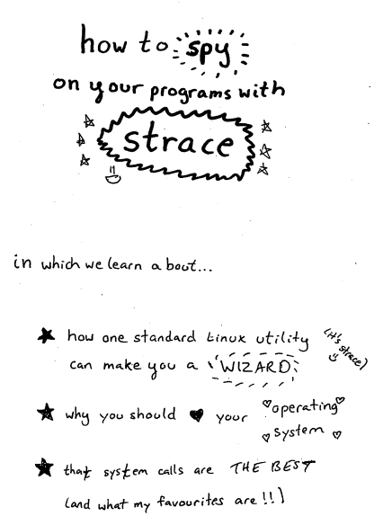

<section class="level1" data-background=slide-images/slide-0.png>   </section>
<section class="level1" data-background=slide-images/slide-1.png>   </section>
<section class="level1" data-background=slide-images/slide-2.png>   </section>
<section class="level1" data-background=slide-images/slide-3.png>   </section>
<section class="level1" data-background=slide-images/slide-4.png>   </section>
<section class="level1" data-background=slide-images/slide-5.png>   </section>
<section class="level1" data-background=slide-images/slide-6.png>   </section>
<section class="level1" data-background=slide-images/slide-7.png>   </section>
<section class="level1" data-background=slide-images/slide-8.png>   </section>

# 

* program 1: "hi"
* (40 ms passes)
* program 2: "oh hi"

program 2 looks slow

</section>

<section class="level1" data-background=slide-images/slide-9.png>   </section>

<section class="level1" data-background=slide-images/slide-10.png>   </section>
<section class="level1" data-background=slide-images/slide-11.png>   </section>
<section class="level1" data-background=slide-images/slide-12.png>   </section>
<section class="level1" data-background=slide-images/slide-13.png>   </section>
<section class="level1" data-background=slide-images/slide-14.png>   </section>
<section class="level1" data-background=slide-images/slide-15.png>   </section>
<section class="level1" data-background=slide-images/slide-16.png>   </section>
<section class="level1" data-background=slide-images/slide-17.png>   </section>
<section class="level1" data-background=slide-images/slide-18.png>   </section>
<section class="level1" data-background=slide-images/slide-19.png>   </section>
<section class="level1" data-background=slide-images/slide-20.png>   </section>
<section class="level1" data-background=slide-images/slide-21.png>   </section>
<section class="level1" data-background=slide-images/slide-22.png>   </section>
<section class="level1" data-background=slide-images/slide-23.png>   </section>
<section class="level1" data-background=slide-images/slide-24.png>   </section>
<section class="level1" data-background=slide-images/slide-25.png>   </section>
<section class="level1" data-background=slide-images/slide-26.png>   </section>
<section class="level1" data-background=slide-images/slide-27.png>   </section>
<section class="level1" data-background=slide-images/slide-28.png>  
<!-- strace: my favorite tool-->
 </section>

# more strace ❤

* find command line incantations
* find a missing log file

# strace looks a little scary...

</section>
<section class="level1" data-background="strace-garbage.png"> 

# a zine

(get one from me tomorrow!)

# what if I use a mac?

# dtrace+dtruss: also amazing

* dtruss = strace for OS X
* won't slow down your programs
* way more powerful
* steeper learning curves

# dtrace

"find me all programs that are reading files from /home"
</section>

<section class="level1" data-background="errinfo.png">   </section>

# is learning dtrace worth it?

# is learning dtrace worth it?    90% of people I asked said YES

</section>
<section class="level1" data-background=slide-images/slide-29.png>   </section>
<section class="level1" data-background=slide-images/slide-30.png>   </section>
<section class="level1" data-background=slide-images/slide-31.png>   </section>

<section class="level1" data-background=slide-images/slide-33.png>   </section>
<section class="level1" data-background=slide-images/slide-34.png>   </section>
<section class="level1" data-background=slide-images/slide-35.png>   </section>
<section class="level1" data-background=slide-images/slide-36.png>   </section>
<section class="level1" data-background=slide-images/slide-37.png>   </section>
<section class="level1" data-background=slide-images/slide-38.png>   </section>
<section class="level1" data-background=slide-images/slide-39.png>   </section>

# how I debug 

- Remember it's logical
- Be confident
- know how computers work
- use strace
- love it

</section>

<section class="level1" data-background=slide-images/slide-41.png> 
<!-- computers are fast -->

  </section>

# 100 requests/s

 or 

# propaganda: computers are fast

to prove it we made a game

computers-are-fast.github.io

</section>

<section class="level1" data-background="grep-before.png">   </section>
<section class="level1" data-background="grep.png">   </section>

<section class="level1" data-background=slide-images/slide-42.png>   </section>
<section class="level1" data-background=slide-images/slide-43.png>   </section>
<section class="level1" data-background=slide-images/slide-44.png>   </section>
<section class="level1" data-background=slide-images/slide-45.png>   </section>
<section class="level1" data-background=slide-images/slide-46.png>   </section>

# What if I use Java?

# What if I use Java?

<h2> 200,000 </h2>

# What if I use Python?

# What if I use Python?

<h2> probably at least 1,000 right... </h2>

# 

if computers are so fast, why couldn't my program do 100 requests/second?

#  

<h2> computers are fast</h2>

<h2> ... but you can make them slow</h2>

# reasons for programs to be slow

1. using too much CPU
2. WAITING

# "a millisecond isn't fast"
<h2> (a story about using too much CPU) </h2>

# a slow program is often just a misunderstanding

# a program at work

* in Java
* millions of records
* hours of computation
* sad julia

# step 1: be sad.

# cool ideas

* "it's reading too much from disk"
* "we're using that function wrong"
* too many objects

# ideas about performance: almost always wrong

# step 2: profile

# visualvm

what am I spending all my CPU time on? (java)

# step 2: profile

The culprit: `DenseHLL$x$6`

??? what does that mean ???

# The culprit

      lazy val (zeroCnt, z) = {
        var count: Int = 0
        var res: Double = 0

        // goto while loop to avoid closure
        val arr: Array[Byte] = v.array
        val arrSize: Int = arr.size
        var idx: Int = 0
        while (idx < arrSize) {
          val mj = arr(idx)
          if (mj == 0) {
            count += 1
            res += 1.0
          } else {
            res += java.lang.Math.pow(2.0, -mj)
          }
          idx += 1
        }
        (count, 1.0 / res)
      }

# The culprit

res += java.lang.Math.pow(2.0, -mj)

# misunderstanding

you didn't WANT to spend 99% of your CPU time computing the same powers of 2?

# step 3: win    result: 100x faster code

# more tools: perf

what am I spending all my CPU time on? (C)

# perf

# reasons for programs to be slow

1. using too much CPU
2. WAITING

# let's talk about waiting

# the case of the slow SQL query

select person from CUSEC where name = 'julia'

# tool 1: time

is it the CPU or am I waiting?

# tool 2: dstat

what is the program waiting for?

# Hard drives are slooooow    networks are worse

# hardware matters

(video time!!!)

# some speeds

- CPU: 6 GB/s
- my hard drive: 50 MB/s
- my network: 2 MB/s

# 

we don't spend all our time waiting for hard drives right?

# DATABASES

# DATABASE

(noun) a software system that lets you wait for a hard drive

# 

* you: I would like data!
* database: ok I will read 100MB from the disk you have to wait
* you: I wanted it faster :(
* database: then use an index lol

# How can I wait less?

1. read less from disk
1. make less network requests
1. multitask

# multitasking

javascript is awesome at multitasking!

(other languages too)

# conclusion    that 100 request/s program is too slow

# have high expectations for computers

computers-are-fast.github.io

# performance work is actually really hard

# you can know (almost) everything about computers

there are really good tools. you can use them today.

# you can be a better programmer

# curiosity will take you everywhere

# Questions?

blog: `jvns.ca`  
`http://twitter.com/b0rk`  
email me! `julia@jvns.ca`
