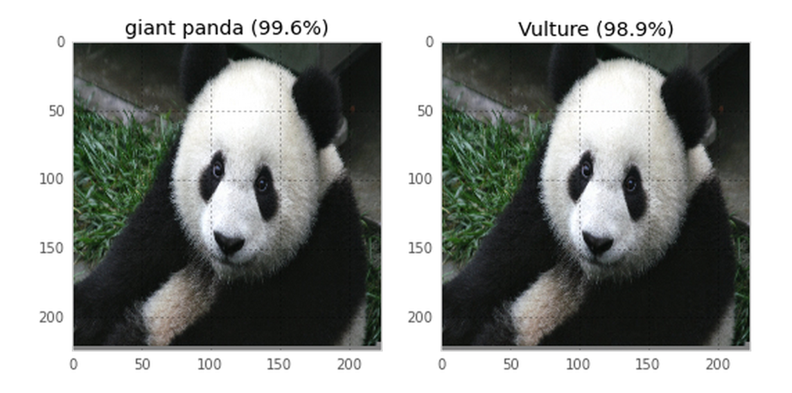
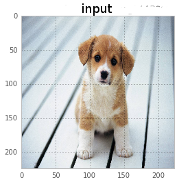
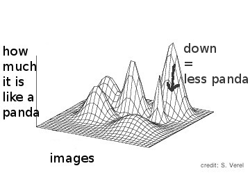
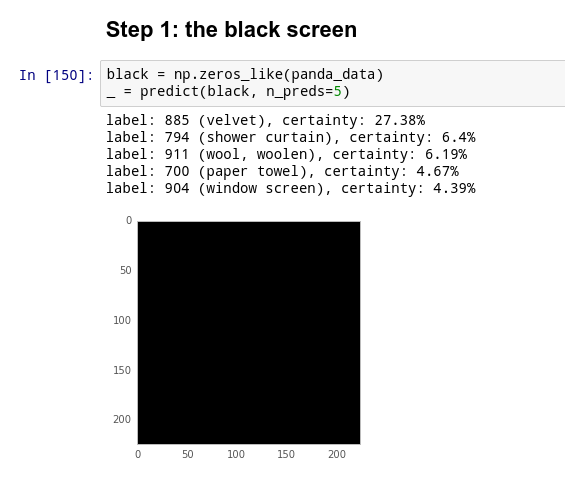
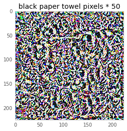

# how to trick a neural network

by Julia Evans  

* twitter: @b0rk  
* blog: jvns.ca

 
notes at http://bit.ly/trick-neural-network

[github]: https://github.com/jvns
[twitter]:  https://twitter.com/b0rk
[website]: http://jvns.ca

  

# machine learning

# step 0: be confused about neural networks

</section>

<section data-background="beaches.png">

</section>

<section data-background="cars.png">

</section>

<section data-background="fire_hydrant.png">
</section>

<section data-background="baby.png">
</section>

<!-- "this is what we're going to talk about" -->

# step 1: read a cool paper

# neural networks aren't magic: they're math

# i have a math degree i can do this =D

# what the paper said

# what the paper said

# can I implement the paper??? (yes)

# a neural network is a function

# 

# 

</section>

<section data-background="cat_data_ndarray.png">

</section>

# step 2: spend 10 hours setting up neural network software

# step 3: download the neural network in the paper

</section>

<section data-background="download_neural_network.png">

</section>

# 50 megabytes

# step 4: PREDICT SOME THINGS WITH IT

</section>

<section data-background="sword.png">

</section>

<section data-background="kitten.png">

</section>

<section data-background="trash.png">

</section>

<section data-background="queen.png">

# step 5: trick it

# back to math for a second

# 

# 

# 

# which direction do we take the image in?

# best direction = derivative

# 

#

</section>

# 

#

</section>

<section data-background="paper_towel_velvet.png">

</section>

# 

# 

# let's do more!!

</section>

<section data-background="panda_vulture_graph.png">

</section>

# what you can do next

* read the paper!
* play with the neural net yourself!
* michael nielsen's neural networks book
* try out tensorflow!
* ask me questions!

# papers we love

#

<h1 style="text-transform:lowercase"> http://bit.ly/trick-neural-network</h1>

* twitter: @b0rk  
* blog: jvns.ca

