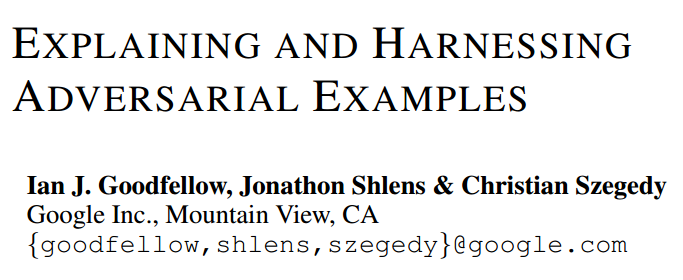
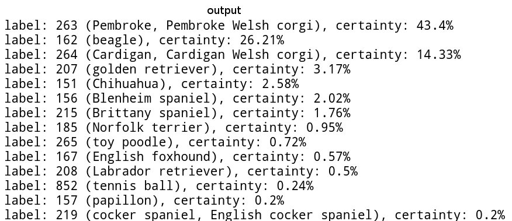
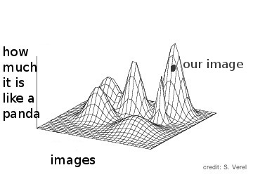
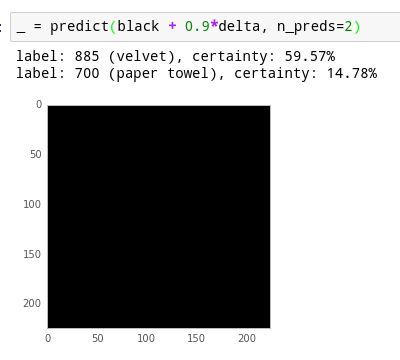
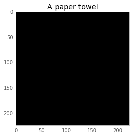
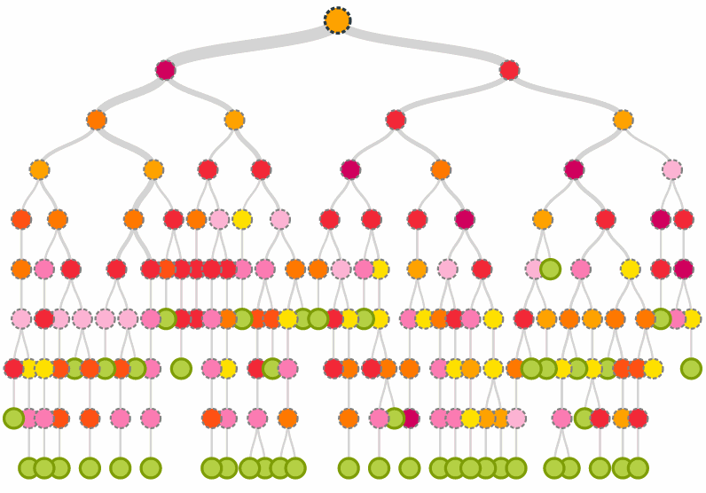

# 

<h1>how to trick a neural network </h1>

<h2> (or: be skeptical of machine learning) </h2>

by Julia Evans  
Stripe  

* twitter: @b0rk  
* blog: jvns.ca

 
notes at http://bit.ly/trick-neural-network

[github]: https://github.com/jvns
[twitter]:  https://twitter.com/b0rk
[website]: http://jvns.ca

  

# ❤ machine learning   😒 machine learning

# about me

* machine learning @ stripe
* stop credit card fraud

# what is machine learning?

# 

* john: probably american
* jean: probably french
* johannes: probably german

# 

<h2> data </h2>

john - american | john - brazilian | john - american | julia - american
| julia - canadian | julia - australian | julia - american 
| julia - canadian | julia - australian | julia - american | julia - american | johannes - german | johannes - german | johannes - german | johannes - american
| julia - canadian | julia - australian | julia - american 
| julia - canadian | julia - australian | julia - american 
| julia - canadian | julia - australian | julia - american 
| julia - canadian | julia - australian | julia - american 
| julia - canadian | julia - australian | julia - american | julia - american | johannes - german | johannes - german | johannes - german | johannes - american
| julia - canadian | julia - australian | julia - american | julia - american | johannes - german | johannes - german | johannes - german | johannes - american
| julia - canadian | julia - australian | julia - american | julia - american | johannes - german | johannes - german | johannes - german | johannes - american
| julia - canadian | julia - australian | julia - american | julia - american | johannes - german | johannes - german | johannes - german | johannes - american
| andy - british | andy - american | andy - canadian
| andy - british | andy - american | andy - canadian
| andy - british | andy - american | andy - canadian
| andy - british | andy - american | andy - canadian
| julia - canadian | julia - australian | julia - american | julia - american | johannes - german | johannes - german | johannes - german | johannes - american
| andy - british | andy - american | andy - canadian

# model

* julia: american (probability = 60%)
* johannes: german (probability = 70%)
* john: american (probability = 40%)
* jean: french (probability = 50%)

# your model is only as good as your data

# fun with machine learning

# neural networks

# 

# step 0: be confused about neural networks

</section>

<section data-background="beaches.png">

</section>

<section data-background="cars.png">

</section>

<section data-background="fire_hydrant.png">
</section>

<section data-background="baby.png">
</section>

<!-- "this is what we're going to talk about" -->

# step 1: read a cool paper

# neural networks aren't magic: they're math

# i have a math degree i can do this =D

# what the paper said

# what the paper said

# can I implement the paper???

# yes

# the code for this is is all an ipython notebook

# a neural network is a function

# 

# 

</section>

<section data-background="cat_data_ndarray.png">

</section>

# step 2: spend 10 hours setting up neural network software

# step 3: download the neural network in the paper

</section>

<section data-background="download_neural_network.png">

</section>

# 50 megabytes

# step 4: PREDICT SOME THINGS WITH IT

</section>

<section data-background="sword.png">

</section>

<section data-background="kitten.png">

</section>

<section data-background="trash.png">

</section>

<section data-background="queen.png">

# step 5: trick it

# step 4.5: be very confused about neural networks

# back to math for a second

# 

# 

# 

# which direction do we take the image in?

# best direction = derivative

# derivative = backpropagation

# 

#

</section>

# 

#

</section>

<section data-background="paper_towel_velvet.png">

</section>

# 

# 

# let's do more!!

# 

# 

# 

# 

# panda -> vulture

</section>

<section data-background="panda_vulture_graph.png">

</section>

#

# what you can do next

* read the paper!
* play with the neural net yourself!
* michael nielsen's neural networks book

# papers we love

#

<h1 style="text-transform:lowercase"> http://bit.ly/trick-neural-network</h1>

# if we can trick a neural network, maybe we can understand it

# ok, so machine learning is cool

# machine learning is also *important*

(otherwise i would never get paid to do it)

# 

* photo classification
* spam filtering
* approving your loan application

# reasons to be skeptical of machine learning

# 1. only as good as the data you put into it

# 

<h2> data </h2>

john - american | john - brazilian | john - american | julia - american
| julia - canadian | julia - australian | julia - american 
| julia - canadian | julia - australian | julia - american | julia - american | johannes - german | johannes - german | johannes - german | johannes - american
| julia - canadian | julia - australian | julia - american 
| julia - canadian | julia - australian | julia - american 
| julia - canadian | julia - australian | julia - american 
| julia - canadian | julia - australian | julia - american 
| julia - canadian | julia - australian | julia - american | julia - american | johannes - german | johannes - german | johannes - german | johannes - american
| julia - canadian | julia - australian | julia - american | julia - american | johannes - german | johannes - german | johannes - german | johannes - american
| julia - canadian | julia - australian | julia - american | julia - american | johannes - german | johannes - german | johannes - german | johannes - american
| julia - canadian | julia - australian | julia - american | julia - american | johannes - german | johannes - german | johannes - german | johannes - american
| andy - british | andy - american | andy - canadian
| andy - british | andy - american | andy - canadian
| andy - british | andy - american | andy - canadian
| andy - british | andy - american | andy - canadian
| julia - canadian | julia - australian | julia - american | julia - american | johannes - german | johannes - german | johannes - german | johannes - american
| andy - british | andy - american | andy - canadian

# what if you forget the data from china?

# 2. programs often have bugs

# 2. machine learning programs often have bugs 

# 3. you didn't tell your model about people

#

# 4. sometimes it just doesn't work

label: baby

<!-- ml is only *supposed* to work like 90% of the time anyway-->

# ... or it has unexpected consequences

</section>

<section data-background="insightful.jpg">
</section>

# be skeptical   &   ask questions

<!-- maybe say the pork in a muslim country here -->

# okay, I found something weird. how do I debug it?

# ★★★   magically guess   ★★★

# 

<h1 style="text-decoration:line-through">

★★★   magically guess   ★★★
</h1>

# 1. look at the model

# 

income = 1000 * age + 10000 * gender

# 

# 

# 2. make two models

1. model your data with a complicated model
1. model your complicated model with a simple model

# 3. talk to an academic

* PhD students = AMAZING
* NIPS = really fun

# it's math,  not magic

# simple systems can work incredibly well

❤❤❤ linear models ❤❤❤

# 

## understand nothing   ⇝ understand something ⇜   understand everything

# thanks!

* twitter: @b0rk  
* blog: jvns.ca
