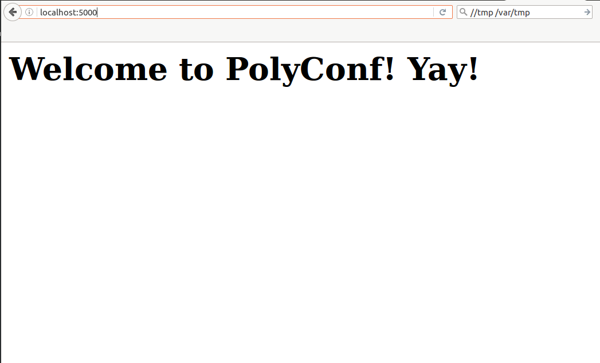
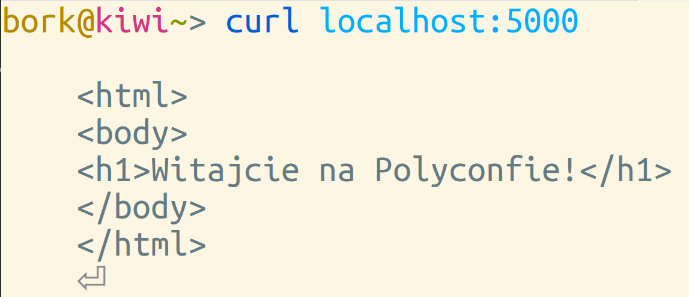
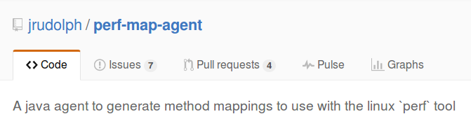
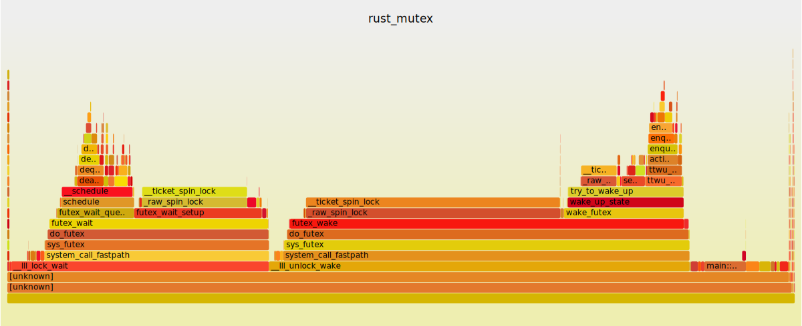

# systems <br> programming <br> is for everyone

by Julia Evans <br>
Stripe<br>

* twitter: @b0rk <br>
* blog: jvns.ca

<br><br>
Tweet questions to @b0rk

# 

<h1 class="none"> 🐞🐞 bugs 🐞🐞</h1>

# 

<div style="font-size:200%; line-height: 200%;">
perl | go | c++ | fortran <br>
php | python | java | smalltalk <br>
INTERCAL | BASIC | erlang
</div>

# mostly Linux 🐧 

# your program <br> = <br> black box

# Debugging:

+ look at the source code
+ add print statements
+ know the programming language

# Debugging:

+ <strike>look at the source code</strike>
+ <strike>add print statements</strike>
+ <strike>know the programming language</strike>
+ ★★★ be a wizard★★★

# 


# This talk

* Wizard school (or, an operating systems primer)
* Chapter 1: The Case of the Mystery Config File
* Chapter 2: The Case of the French Website
* Chapter 3: The Case of the Slow Program

# Wizard School <br> -or- <br> why you should ❤ your operating system

# What is an operating system for?

# 

When I go to http://google.com, kernel code runs for:

+ Typing in the address
+ Handling every network packet
+ Writing history files to disk
+ Allocating memory
+ Communicating with the graphics card

# How to call <br>operating system code

# ★★★ <br> System calls!!! <br> ★★★ 

# System calls: <br> an OS's interface

* open a file! (`open`)
* start a program! (`execve`)
* change a file's permissions! (`chmod`)

# What we've learned 

+ Your OS does tons of stuff
+ Programs tell it what to do using system calls

# Using systems <br> knowledge to debug

# Chapter 1: <br> The Case of the <br> Mystery Config File

# 

<div style="font-size:300%; line-height: 120%;">
Does bash use `.bash_profile` or `.bashrc`??!??
</div>

# strace <br> = <br> ⚡ wizardry ⚡

# strace <br> = <br> tracing system calls

# How to strace

```
$ strace google-chrome
execve("/usr/bin/google-chrome", ["google-chrome"], [/* 51 vars */]) = 0
brk(0)                                  = 0x124f000
access("/etc/ld.so.nohwcap", F_OK)      = -1 ENOENT (No such file or directory)
```

</section>
<section data-background="strace-garbage.png">

# open

<pre class="big">
strace -e open bash
</pre>


# bashrc wins!

# other awesome <br> system calls

* `write` for log files
* `execve` for starting programs
* `recvfrom` for receiving data

# strace zine


# opensnoop

<h2> linux 🐧 & OS X 🍎 !</h2>

<pre class="big">
https://github.com/iovisor/bcc
</pre>


# 

<pre class="big">
opensnoop(8)                                                                                 System Manager's Manual                                                                                opensnoop(8)

NAME
       opensnoop - Trace open() syscalls.
       Uses Linux eBPF/bcc.

...

AUTHOR
       Brendan Gregg

</pre>

# Chapter 2: <br> The Case of the <br> Polish Website

# 



# 



# ???

# network spying TO THE RESCUE

# tcpdump

<pre class="big">sudo tcpdump port 5000 -i any 
-o polish-website.pcap </pre></h2>

# wireshark

<pre class="big">
wireshark polish-website.pcap
</pre>

#
<pre class="big">
Accept-Language: en-US,en;q=0.5\r\n
</pre>

#


# wireshark: assigner of blame


# 

<h1 style="text-transform: none">why tcpdump is fast: BPF (berkeley packet filter)</h1>

<pre class="big">
src ip 192.168.0.1 or dst ip 192.168.0.1
</pre>

# network spying tools

- ngrep
- tcpdump
- wireshark
- mitmproxy


# Chapter 3: <br> The Case of the <br> Slow Program

# 3 Slow programs

1. CPU time
1. too many writes
1. waiting for a slow server

# Mystery program #1

# 

<pre class="big">
$ time python mystery_1.py
0.09user 0.01system
0:02.11elapsed 5%CPU 
</pre>

# What is it waiting for? 

# Let's look into the kernel's soul

# /proc/`pid`/stack

```
$ pgrep -f mystery_1
31728
$ sudo cat /proc/31728/stack
[<ffffffff81702467>] sk_wait_data+0x107/0x120
[<ffffffff81767112>] tcp_recvmsg+0x2e2/0xb80
[<ffffffff81794d6e>] inet_recvmsg+0x7e/0xb0
[<ffffffff816fdb6b>] sock_recvmsg+0x3b/0x50
[<ffffffff816fddc1>] SYSC_recvfrom+0xe1/0x160
[<ffffffff816ff1ce>] SyS_recvfrom+0xe/0x10
[<ffffffff818244f2>] entry_SYSCALL_64_fastpath+0x16/0x71
[<ffffffffffffffff>] 0xfffffffffffffff
```

# We win! It was the network!

# Our server

<pre class="big">
@app.route('/')
def slow():
    time.sleep(2)
    return "Hi!"
app.run()
</pre>

# Mystery program #2

<pre class="big">
$ time python mystery_2.py
2.74user 0.00system

2.74 seconds 99%CPU 
</pre>

# Use a python profiler

# 

<pre class="big">
total = 0
for i in xrange(14000000):
    total += i
</pre>

# Mystery program #3

# (really a mystery)

# 

<pre class="big">
$ time python mystery_3.py 
0.03user 4.11system

4.40 seconds elapsed 94%CPU
</pre>

# demo demo

# 

<pre class="big">
29,81%  [kernel] _aesni_enc1        
1,88%   [kernel] ecryptfs_write_begin     ▒
1,51%   [kernel] raw_spin_lock          
</pre>


#  mystery solved

<pre class="big">
filename = '/home/bork/fake.txt'
</pre>

# 

<h1 style="text-transform: none">❤ dstat ❤</h1>

# 

<h1 style="text-transform: none">❤ perf top ❤</h1>

# works great with the JVM & node 



#



# your program <br> = <br> black box

# there are a lot of awesome tools

# learn your operating system

(or your browser.)

# 

Recurse Center


# Thanks!

* Julia Evans
* twitter: @b0rk <br>
* learn more by reading my blog: http://jvns.ca

<br><br>
Come ask me questions & get a zine!
