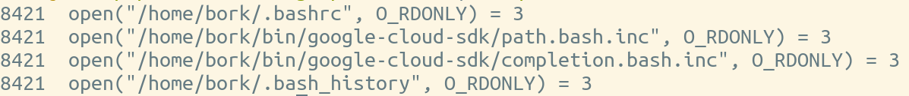
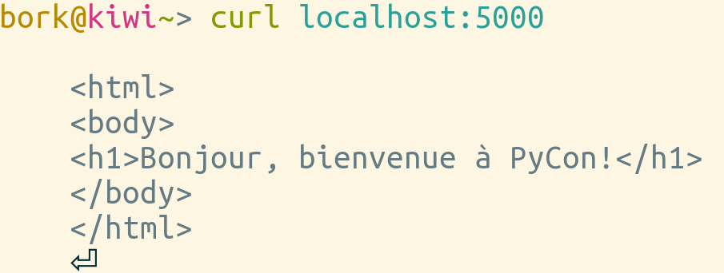
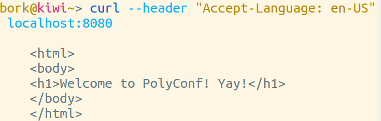

# spying on your programs

by Julia Evans <br>
Stripe<br>

* twitter: @b0rk <br>
* blog: jvns.ca

[github]: https://github.com/jvns
[twitter]:  https://twitter.com/b0rk
[website]: http://jvns.ca

<br><br>
Tweet questions to @b0rk

# 


# 

<div style="font-size:200%; line-height: 200%;">
perl | go | c++ | fortran <br>
php | python | java | smalltalk <br>
INTERCAL | BASIC
</div>


# Linux-only

# your program <br> = <br> black box

# Debugging:

+ look at the source code
+ add print statements
+ know the programming language

# Debugging:

+ <strike>look at the source code</strike>
+ <strike>add print statements</strike>
+ <strike>know the programming language</strike>
+ ★★★ be a wizard★★★

# 


# This talk

* Wizard school (or, an operating systems primer)
* Chapter 1: The Case of the Mystery Config File
* Chapter 2: The Case of the French Website
* Chapter 3: The Case of the Slow Program

# Wizard School <br> -or- <br> why you should ❤ your operating system

# What is an operating system for?

# 

When I go to http://google.com, kernel code runs for:

+ Typing in the address
+ Handling every network packet
+ Writing history files to disk
+ Allocating memory
+ Communicating with the graphics card

# How to call operating system code

# ★★★ <br> System calls!!! <br> ★★★ 

# System calls: <br> an OS's interface

* open a file! (`open`)
* start a program! (`execve`)
* change a file's permissions! (`chmod`)

# What we've learned 

+ Your OS does tons of stuff
+ Programs tell it what to do using system calls

# Using systems knowledge to debug

# Chapter 1: <br> The Case of the <br> Mystery Config File

# 

<div style="font-size:300%; line-height: 120%;">
Does bash use `.bash_profile` or `.bashrc`??!??
</div>

# strace <br> = <br> wizardry

# strace <br> = <br> tracing system calls

# How to strace

```
$ strace google-chrome
execve("/usr/bin/google-chrome", ["google-chrome"], [/* 51 vars */]) = 0
brk(0)                                  = 0x124f000
access("/etc/ld.so.nohwcap", F_OK)      = -1 ENOENT (No such file or directory)
```

</section>
<section data-background="strace-garbage.png">

# open

<pre class="big">
strace -e open bash
</pre>


# bashrc wins!

# other awesome system calls

* `write` for log files
* `execve` for starting programs
* `recvfrom` for receiving data

# strace zine

#


# Chapter 2: <br> The Case of the <br> French Website

# 


# 



# ???

# network spying TO THE RESCUE

# 

```
sudo ngrep -d lo 5000
interface: lo (127.0.0.0/255.0.0.0)
match: 5000
####
T 127.0.0.1:45438 -> 127.0.0.1:5000 [AP]
  GET / HTTP/1.1..Host: localhost:5000..Connection:
keep-alive..Cache-Control: max-age=0..Accept:
text/html,application/xhtml+xml,application
/xml;q=0.9,image/webp,*/*;q=0.8..User-Agent: Mozilla/5.0 (X11; Linux
x86_64) AppleWebKit/537.36 (KHTML, like Gecko) Chrome/41.0.2272.53 Saf
ari/537.36..DNT: 1..Accept-Encoding: gzip, deflate,
sdch..Accept-Language: en-US,en;q=0.8..Cookie:
username-localhost-8888="2|1:0|10:142841
1879|23:username-localhost-8888|48:MjYzMTc2NGMtYTA1MC00YjNkLTkyYTktNGFhY2U3NmUwMjdj|f5f14c08e970bd6c81f8efe3f3a8b98edd85de834e88c250e96fdb7
fab7ee279"....
#######################
T 127.0.0.1:45440 -> 127.0.0.1:5000 [AP]
  GET / HTTP/1.1..User-Agent: curl/7.22.0 (x86_64-pc-linux-gnu)
libcurl/7.22.0 OpenSSL/1.0.1 zlib/1.2.3.4 libidn/1.23
librtmp/2.3..Host: localhost:5000..Accept: */*....                                                                                                                
##################
```

# 

<pre class="big">
Accept-Language: en-US
</pre>

#




# network spying tools

- ngrep
- tcpdump
- wireshark
- mitmproxy


# Chapter 3: <br> The Case of the <br> Slow Program

# 3 Slow programs

1. CPU time
1. too many writes
1. waiting for a slow server

# Mystery program #1

# 

<pre class="big">
$ time python mystery_1.py
0.09user 0.01system 0:02.11elapsed 5%CPU 
</pre>

# What is it waiting for? 

# Let's look into the kernel's soul

# /proc/`pid`/stack

```
$ pgrep -f mystery_1
31728
$ sudo cat /proc/31728/stack
[<ffffffff81702467>] sk_wait_data+0x107/0x120
[<ffffffff81767112>] tcp_recvmsg+0x2e2/0xb80
[<ffffffff81794d6e>] inet_recvmsg+0x7e/0xb0
[<ffffffff816fdb6b>] sock_recvmsg+0x3b/0x50
[<ffffffff816fddc1>] SYSC_recvfrom+0xe1/0x160
[<ffffffff816ff1ce>] SyS_recvfrom+0xe/0x10
[<ffffffff818244f2>] entry_SYSCALL_64_fastpath+0x16/0x71
[<ffffffffffffffff>] 0xfffffffffffffff
```

# We win! It was the network!

# Our server

<pre class="big">
@app.route('/')
def slow():
    time.sleep(2)
    return "Hi!"
app.run()
</pre>

# Mystery program #2

<pre class="big">
$ time python mystery_2.py
2.74user 0.00system 0:02.74elapsed 99%CPU 
</pre>

# Use a python profiler

# 

<pre class="big">
total = 0
for i in xrange(14000000):
    total += i
</pre>

# Mystery program #3

# (really a mystery)

# 

<pre class="big">
$ time python mystery_3.py 
0:02.61elapsed 62%CPU
$ time python mystery_3.py 
0:10.61elapsed 10%CPU
</pre>

# demo demo

# we win

# your program <br> = <br> black box

# there are a lot of awesome tools

# learn your operating system

# 

Recurse Center


# Thanks!

* Julia Evans
* twitter: @b0rk <br>
* learn more by reading my blog: http://jvns.ca

<br><br>
Come get a strace zine!!!!!

[twitter]:  https://twitter.com/b0rk
[website]: http://jvns.ca
