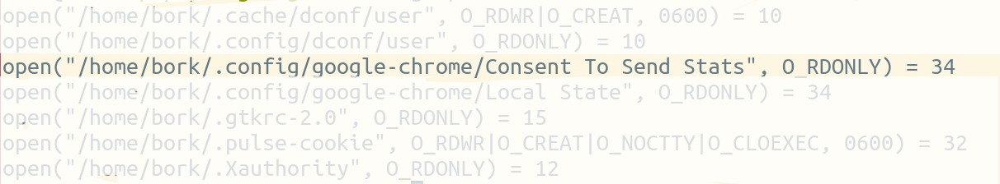

# Spying on your programs with strace

by Julia Evans <br>
[`twitter.com/b0rk`][twitter]  <br>
[`github.com/jvns`][github]  <br>
[`jvns.ca`][website]  <br>

[github]: https://github.com/jvns
[twitter]:  https://twitter.com/b0rk
[website]: http://jvns.ca


# Disclaimer: <br>Linux-only

# Debugging:

+ look at the source code
+ add print statements
+ know the programming language

# strace <br> = <br> wizardry

# System calls: <br> a OS's API

# System calls

+ open
+ execve
+ sendto/recvfrom

# How to strace

```
$ strace google-chrome
execve("/usr/bin/google-chrome", ["google-chrome"], [/* 51 vars */]) = 0
brk(0)                                  = 0x124f000
access("/etc/ld.so.nohwcap", F_OK)      = -1 ENOENT (No such file or directory)
```

</section>
<section data-background="strace-garbage.png">

# open

```
strace -etrace=open google-chrome
```


# open

```
strace -etrace=open google-chrome
```


# open

```
$ cat ~/.config/google-chrome/Consent\ To\ Send\ Stats
6795275A1128269862CB7A471F5E0228% 
```

# execve

```
$ strace -f -etrace=execve google-chrome
6116  execve("/opt/google/chrome/chrome", ["/usr/bin/google-chrome"], 
[/* 52 vars */]) = 0
6123  execve("/opt/google/chrome/chrome-sandbox", 
    ["/opt/google/chrome/chrome-sandbox", 
    "/opt/google/chrome/chrome", 
    "--type=zygote", 
    "--enable-crash-reporter=6795275A1128269862CB7A471F5E0228,Ubuntu 12.04.4 LTS"], 
    [/* 55 vars */]) = 0
```

# sendto

```
connect(8, {sa_family=AF_INET, sin_port=htons(9200),
    sin_addr=inet_addr("10.147.177.170")}, 16) = 0
sendto(8,
    "\nB\n5\n3\n(BP-1019336183-10.165.43.39-1400088409498\20\211\200\200\200\4\30\361\7\22\tsnakebite\20\0\30\200\200\200@",
    75, 0, NULL, 0) = 75
```

# recvfrom

```
recvfrom(8, "ot, it's a painting. Thomas Graeme apparently lived in
the mid-18th century, according to the [[Graeme Park]] article. The
rationale also says that this image is "used on the biography
page about him by USHistory.org of Graeme Park." I cannot quite
figure out what this means, but I am guessing that it means the
uploader took this image from a page hosted on USHistory.org. A
painting of a man who lived in the mid-18th century is likely to be
the public domain, as claimed, but we have no good source", 512, 0,
NULL, NULL) = 512
```


# write

+ spy on log files!

# Thanks!

* strace all the things!
* on OS X / Windows, try **sysdig**
* Notes: [http://bit.ly/strace-notes](http://bit.ly/strace-notes)

[`twitter.com/b0rk`][twitter]  <br>
[`jvns.ca`][website]  <br>

[twitter]:  https://twitter.com/b0rk
[website]: http://jvns.ca


