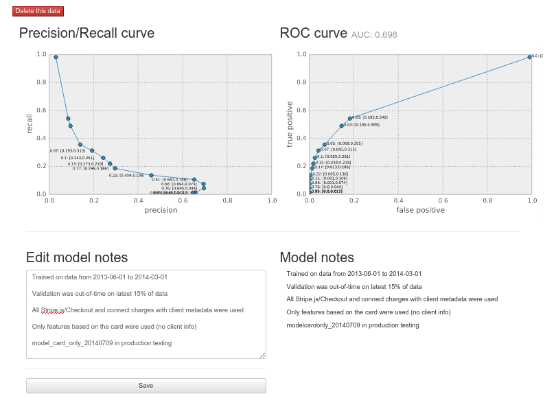
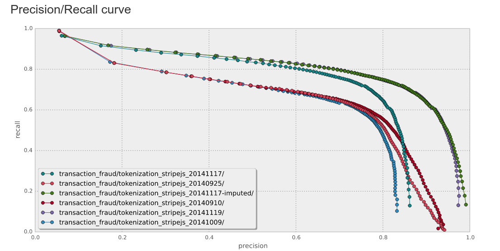
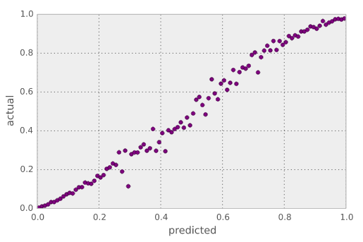

# Recalling with precision

by Julia Evans <br>

[`twitter.com/b0rk`][twitter]  <br>
[`github.com/jvns`][github]  <br>
[`jvns.ca`][website]  <br>


# Machine learning: the boring parts

by Julia Evans <br>

[`twitter.com/b0rk`][twitter]  <br>
[`github.com/jvns`][github]  <br>
[`jvns.ca`][website]  <br>

[github]: https://github.com/jvns
[twitter]:  https://twitter.com/b0rk
[website]: http://jvns.ca


# How to not cry when someone asks you about a model you built 2 months ago

# Proving that they're paying you to build models for a reason

# No more handcrafted artisanal data visualizations

(h/t @DanielleSucher)

# This talk is not

* Building new models is so fun
* CHANGING THE WORLD WITH COMPUTERS
* New and exciting algorithms

# This talk

1. Evaluating models matters
    * The problems that we solve are important
    * Our models have to actually work
    * Keeping track is hard
    * Bad machine learning practices
1. ACTUALLY DOING IT: Implementation details
    * How to have less regrets 5 months into a project
    * A concrete strategy and metrics
    * Open source!

# ML at Stripe: <br> mostly fraud detection

# ML at Stripe


<br>


# Fraud costs merchants money

1. Fraudster buys item for $600, sells it on eBay
2. Cardholder complains to their bank, creates a chargeback
3. Merchant **has to give the money bank**

# It's too much for humans to review

# ★★★ <br>MACHINE LEARNING <br>★★★

# 
```
card_number: <some valid-looking number>
name: John Doe
card_country: US
billing_address_country: Venezuela
ip_address_country: Australia
```

80% likely to be fraudulent.

# Does it work?

* What's the false positive rate? 
* How much of the fraud do we actually catch?

# It matters

* credit card fraud costs merchants money
* blocking the wrong payments costs merchants money

# There are tradeoffs


# Keeping track of tradeoffs is *hard*

# Keeping track

* What data did I train on? (december 2013 - april 2014?)
* How did I split the data into a training set and a test set? (randomly? by date?)
* How did I transform my features? Did I need to lowercase the billing address country?
* What set of features did I use?
* If I trained a decision tree, did I set a maximum depth?

# Version control isn't enough

* too much discipline to commit everything
* too much time to reproduce results

# Bad practices: not evaluating your model at all

# A cautionary tale

A model being used to decide whether or not to *fire teachers*,
discussed by Cathy O'Neil


**You don't want this to be you**

# Objections to evaluating your models

* We don't need to measure this change, we **know** it'll be better.
* We don't have time to measure
* Generic measures can't cover my particular artisanal case

# Bad practices: not evaluating your model at all

# Bad practices: Handcrafted artisanal data visualizations

Have you spent way too long wrangling matplotlib to make the graph you
want? it's boring. Having standard graphing tools is *amazing*.

# Bad practices: no standardization

* Can't compare graphs that measure different things
* Forced us to sit down and decide what metrics are actually important

# Bad practices: throwing your evaluations away

```
rm roc_curve_2014-01-07_with_billing_address_features.png
```

# Tenets

1. Evaluating your model should be easy
1. Standardize your metrics
1. Don't throw away your data
1. Comparing models should be easy

#

## **&lt;/motivational speech&gt;** <br> **&lt; reality &gt;**

# Reality

**139 models** for detecting fraudulent payments

* Some experiments, some we're running in production
* Standard set of metrics for **all of them**
* Can look up how well a given model performed in one click.

# What it looks like

# Stripe's next <br> top model


#


# 



#


#



# How it works

# 1. Standard format for results

**Only binary classifiers**


```
target     score
False      0.2
True       0.8
False      0.7
False      0.1
True       0.9
```

# 1. Lets us change our mind later

# 2. Metadata

* what git revision did it come from?
* How did I split the data into a training set and a test set? (randomly? by date?)
* How did I transform my features? Did I need to lowercase the billing address country?
* What set of features did I use?
* If I trained a decision tree, did I set a maximum depth?
* Which features were important?

# 2. Metadata: notes.txt

* exactly where did the training data come from?
* how did we filter them?
* the features importances for each feature

# 3. Put everything in s3

```
$ aws s3 ls s3://stripe-topmodel
card_only_model_2014-07-07-23:26/scores.tsv
card_only_model_2014-07-07-23:26/notes.txt
card_only_model_2014-07-11-00:58/scores.tsv
card_only_model_2014-07-11-00:58/notes.txt
````

# 4. Metrics

# precision / recall


# ROC curve


# Marginal precision



# Score distribution


# Things I learned

# don't throw away your data

show the new stuff!

# done > perfect

# simple solution > no solution

# having evaluations stored is *awesome*


# The dream


# The dream


# The team


<br>


# It's open source!

<a href="http://github.com/stripe/topmodel">http://github.com/stripe/topmodel</a>


# Thanks! Questions?


<b>Julia Evans</b> <br><br>

[`twitter.com/b0rk`][twitter]  <br>
[`jvns.ca`][website]  <br>
`julia@stripe.com`  <br>
`http://github.com/stripe/topmodel` <br>


